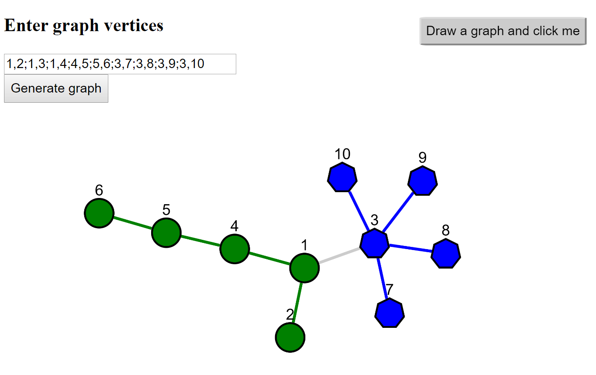

# Two-teams-graph
##Two teams graph: discrete mathemathics project

###USER MANUAL:
Enter adjacent structure of edges into the input field separating nodes of edges by commas and edges by semi-columns.
For example: 
1,2;1,5;1,3;1,4;2,3;3,5;5,6;6,7;7,8;8,9;9,10
1,2;1,3;1,4;4,5;5,6;3,7;3,8;3,9;3,10
Then click button "Generate graph".
After getting your graph generated, you can drag the nodes how you want.
Click button "Draw a graph and click me" to get the two possible teams nodes from the graph.

###Preview graph:

